

Analyzing text with Azure Machine Learning and Cognitive Services

Hands-on lab step-by-step

November 2021

Information in this document, including URL and other Internet Web site references, is subject to change without notice. Unless otherwise noted, the example companies, organizations, products, domain names, e-mail addresses, logos, people, places, and events depicted herein are fictitious, and no association with any real company, organization, product, domain name, e-mail address, logo, person, place or event is intended or should be inferred. Complying with all applicable copyright laws is the responsibility of the user. Without limiting the rights under copyright, no part of this document may be reproduced, stored in or introduced into a retrieval system, or transmitted in any form or by any means (electronic, mechanical, photocopying, recording, or otherwise), or for any purpose, without the express written permission of Microsoft Corporation.

Microsoft may have patents, patent applications, trademarks, copyrights, or other intellectual property rights covering subject matter in this document. Except as expressly provided in any written license agreement from Microsoft, the furnishing of this document does not give you any license to these patents, trademarks, copyrights, or other intellectual property.

The names of manufacturers, products, or URLs are provided for informational purposes only, and Microsoft makes no representations and warranties, either expressed, implied, or statutory, regarding these manufacturers or the use of the products with any Microsoft technologies. The inclusion of a manufacturer or product does not imply endorsement of Microsoft of the manufacturer or product. Links may be provided to third-party sites. Such sites are not under the control of Microsoft and Microsoft is not responsible for the contents of any linked site or any link contained in a linked site, or any changes or updates to such sites. Microsoft is not responsible for webcasting or any other form of transmission received from any linked site. Microsoft is providing these links to you only as a convenience, and the inclusion of any link does not imply endorsement of Microsoft of the site or the products contained therein.

© 2021 Microsoft Corporation. All rights reserved.

Microsoft and the trademarks listed at <https://www.microsoft.com/en-us/legal/intellectualproperty/Trademarks/Usage/General.aspx> are trademarks of the Microsoft group of companies. All other trademarks are the property of their respective owners.

**Contents**

- [Analyzing text with Azure Machine Learning and Cognitive Services hands-on lab step-by-step](#analyzing-text-with-azure-machine-learning-and-cognitive-services-hands-on-lab-step-by-step)
  - [Abstract and learning objectives](#abstract-and-learning-objectives)
  - [Overview](#overview)
  - [Solution architecture](#solution-architecture)
  - [Requirements](#requirements)
  - [Exercise 1: Create and Deploy a Summarization Service](#exercise-1-create-and-deploy-a-summarization-service)
    - [Task 1: Locate and open the Summarization notebook](#task-1-locate-and-open-the-summarization-notebook)
    - [Task 2: Run Notebook - 01 Summarize](#task-2-run-notebook---01-summarize)
    - [Task 3: Run Notebook - 02 Deploy Summarizer Web Service](#task-3-run-notebook---02-deploy-summarizer-web-service)
  - [Exercise 2: Create and Deploy a Custom Deep Learning Model using Keras](#exercise-2-create-and-deploy-a-custom-deep-learning-model-using-keras)
    - [Task 1: Run Notebook - 03 Claim Classification](#task-1-run-notebook---03-claim-classification)
    - [Task 2: Run Notebook - 04 Deploy Classifier Web Service](#task-2-run-notebook---04-deploy-classifier-web-service)
  - [Exercise 3: Text Classification with Azure Automated Machine Learning](#exercise-3-text-classification-with-azure-automated-machine-learning)
    - [Task 1: Create New Automated Machine Learning Experiment](#task-1-create-new-automated-machine-learning-experiment)
    - [Task 2: Create a new Automated ML run](#task-2-create-a-new-automated-ml-run)
    - [Task 3: Monitor Automated ML run](#task-3-monitor-automated-ml-run)
    - [Task 4: Review Best Model Performance](#task-4-review-best-model-performance)
  - [Exercise 4: Completing the solution](#exercise-4-completing-the-solution)
    - [Task 1: Retrieve the Text Analytics API endpoint and key](#task-1-retrieve-the-text-analytics-api-endpoint-and-key)
    - [Task 2: Run Notebook - 05 Cognitive Services](#task-2-run-notebook---05-cognitive-services)
  - [After the hands-on lab](#after-the-hands-on-lab)
    - [Task 1: Clean up lab resources](#task-1-clean-up-lab-resources)

# Analyzing text with Azure Machine Learning and Cognitive Services hands-on lab step-by-step

## Abstract and learning objectives

In this hands-on lab, you implement a solution that combines both pre-built artificial intelligence (AI) in the form of various Cognitive Services with custom AI in the form of services built and deployed with Azure Machine Learning service. In the lab, you work with unstructured text and learning how to develop analytics pipelines for various problems such as text summarization, text classification, sentiment analysis, opinion mining, key phrase extraction, and language and PII detection. You learn how to build and train a deep neural net for text classification. You will also learn to build Automated Machine Learning models in Azure Machine Learning studio for the purposes of text classification. Finally, you learn how to deploy multiple kinds of predictive services using Azure Machine Learning and learn to integrate with the Text Analytics API from Cognitive Services.

At the end of this hands-on lab, you will be better able to present solutions leveraging Azure Machine Learning services and Cognitive Services.

## Overview

In this workshop, you help Contoso Ltd. build a proof of concept that shows how they can develop a solution that amplifies their agents' claims processing capabilities.

## Solution architecture

The high-level architecture of the solution is illustrated in the diagram. The lab is performed within the context of a notebook running within Azure Machine Learning compute instance. Various notebooks are built to test the integration with the Cognitive Services listed, train custom ML services, and integrate the results in a simple user interface that shows the effect of processing the claim with all the AI services involved.

## Requirements

1. You will need an Azure subscription with permissions to deploy resource groups and resources into them.

    - Trial subscriptions will not work. You will run into issues with Azure resource quota limits.
    - Subscriptions with access limited to a single resource group will not work. You will need the ability to deploy multiple resource groups.

## Exercise 1: Create and Deploy a Summarization Service

Duration: 60 minutes

In this exercise, you create and deploy a web service that uses a pre-trained model to summarize long text paragraphs.

### Task 1: Locate and open the Summarization notebook

In this task, you will navigate to the folder where all the notebooks for this lab are available. Then you will open the `Summarization` notebook and confirm that the compute instance is attached to the notebook.

1. From within Azure Machine Learning studio, navigate to the `Notebooks` section by selecting it from the left-hand navigation menu. Then select the notebook: **mcw-csdl/MCW-Analyzing-text-with-azure-machine-learning-and-cognitive-services/Hands-on lab/notebooks/01 Summarize.ipynb**. From the toolbar select **Compute** and confirm that the compute instance created in `Before the HOL - Analyzing text with Azure Machine Learning and Cognitive Services` is selected and is in running state.

    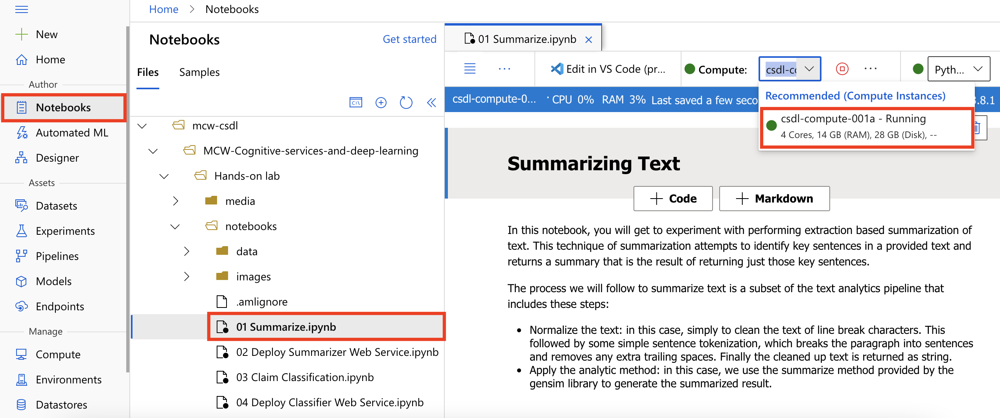

### Task 2: Run Notebook - 01 Summarize

1. Read the instructions at the top of the notebook, and execute the notebook cells one by one by selecting the **Run cell** arrow.

    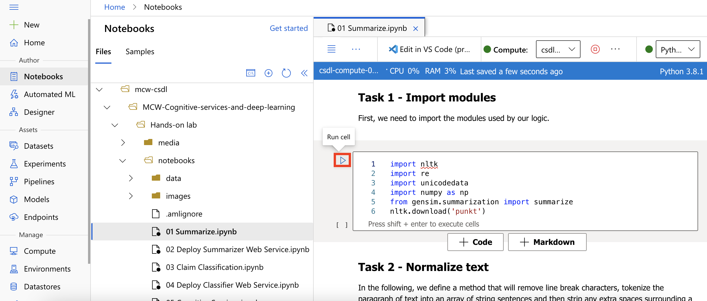

### Task 3: Run Notebook - 02 Deploy Summarizer Web Service

1. Within the `notebooks` folder, select the notebook called **02 Deploy Summarizer Web Service.ipynb**. This opens the notebook so you can read and execute the code it contains.

2. Read the instructions at the top of the notebook, and execute the cells as instructed.

3. Make sure you copy the scoring URI from the output of the last cell of this notebook. The scoring URI value is needed in the final notebook of this hands-on lab.

## Exercise 2: Create and Deploy a Custom Deep Learning Model using Keras

Duration: 60 minutes

In this exercise, you use Keras to construct and train a Deep Neural Network (DNN) called the Long Short-Term Memory (LSTM) recurrent neural network. LSTM works well for text classification problems, especially when used in conjunction with word embedding such as GloVe for word vectorization. In this notebook, you also learn how GloVe word embeddings perform on word analogy tasks.

### Task 1: Run Notebook - 03 Claim Classification

1. Within the `notebooks` folder, select the notebook named **03 Claim Classification.ipynb**. This opens the notebook so you can read and execute the code it contains.

2. Read the instructions at the top of the notebook, and execute the cells as instructed.

   > **Note**: Pay attention to the top of the notebook and check the TensorFlow library version. The TensorFlow version should be 2.2.0.

### Task 2: Run Notebook - 04 Deploy Classifier Web Service

1. Within the `notebooks` folder, select the notebook named **04 Deploy Classifier Web Service.ipynb**. This opens the notebook so you can read and execute the code it contains.

2. Read the instructions at the top of the notebook, and execute the cells as instructed.

3. Make sure you copy the scoring URI from the output of the last cell of this notebook. The scoring URI value is needed in the final notebook of this hands-on lab.

## Exercise 3: Text Classification with Azure Automated Machine Learning

Duration: 75 minutes

Automated machine learning picks an algorithm and hyperparameters for you and generates a model ready for deployment. You can create and run automated machine learning experiments in code using the [Azure ML Python SDK](https://docs.microsoft.com/en-us/azure/machine-learning/service/how-to-configure-auto-train) or if you prefer a no code experience, you can also Create your automated machine learning experiments in the [Azure portal](https://docs.microsoft.com/en-us/azure/machine-learning/service/how-to-create-portal-experiments).

In this exercise, you learn how to create, run, and explore automated machine learning experiments in the Azure portal without a single line of code. We will train a classification model for claim text that will predict `1` if the claim is an auto insurance claim or `0` if it is a home insurance claim.

> Note: You need to complete running the notebook **03 Claim Classification.ipynb** from `Exercise 2 Task 1` before starting this exercise.

### Task 1: Create New Automated Machine Learning Experiment

1. From within Azure Machine Learning studio, select **Home, Create new, Automated ML run**.

   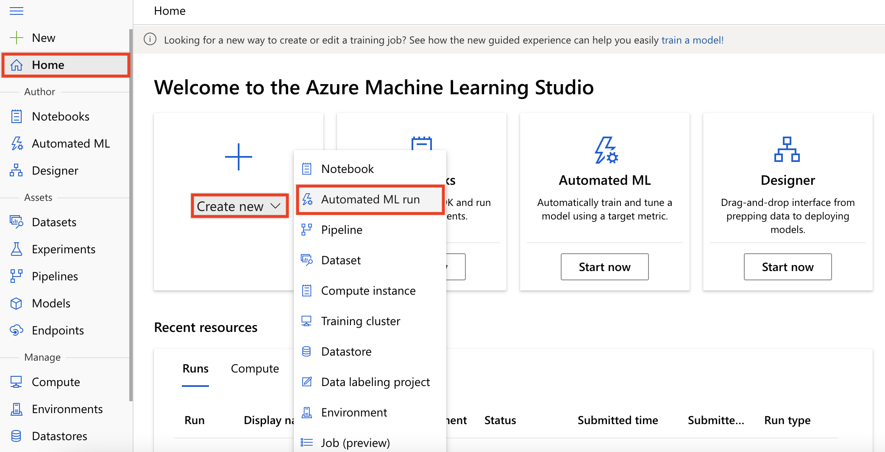

1. This will open a `Create a new Automated ML run` page.

### Task 2: Create a new Automated ML run

1. Select the dataset **claims-dataset** created during `Exercise 2` and then select **Next**.

  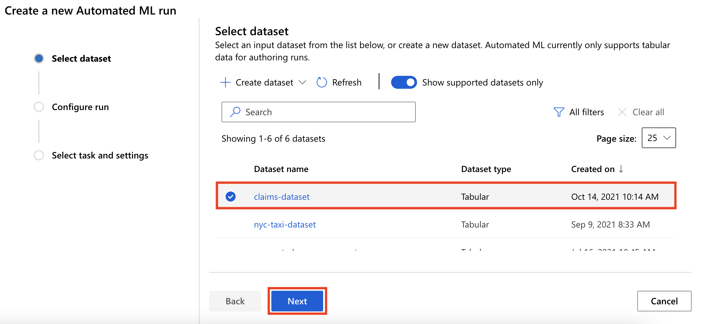

2. In the `Configure run` page, make the following selections, and then select **Next**:

   - Existing experiment: **claims-classification-exp**
   - Target column: **labels (Integer)**
   - Select Azure ML compute cluster: **amlcompute-ad**

  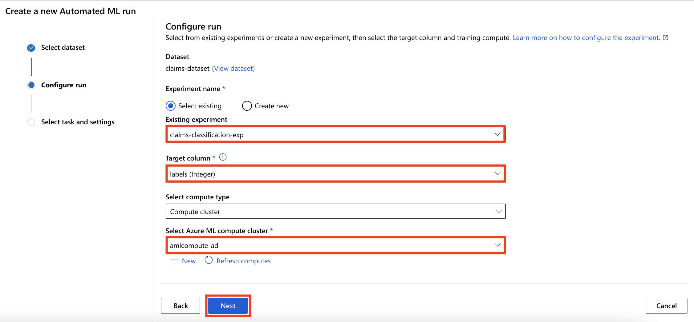

3. In the `Select task type` page make the following selections, and then open the `Additional configurations` dialog by selecting **View additional configuration settings**:

   - Task type: **Classification**
   - Enable deep learning: **Checked**

4. In the `Additional configurations` dialog make the following selections and then select **Save**:

   - Training job timeout (hours): **1**
   - Validation type: **Train-validation split**
   - Percentage validation of data: **10**

5. In the `Select task type` page select **Finish** to start the AutoML experiment run.

  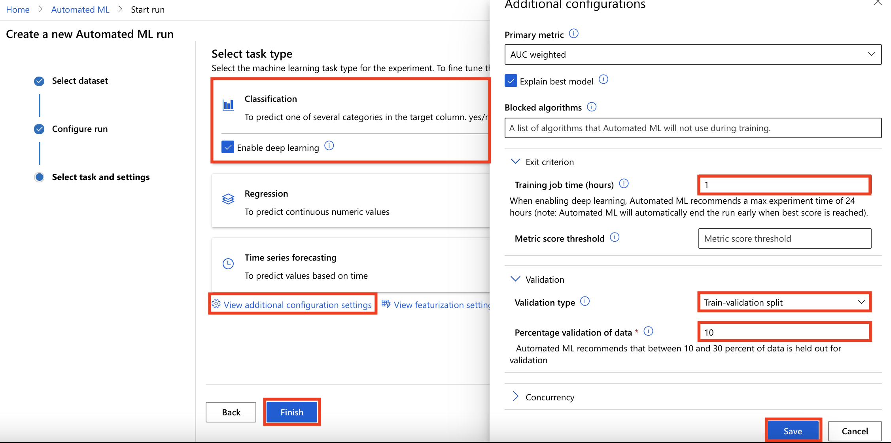

### Task 3: Monitor Automated ML run

1. You can monitor the experiment from the run details page. Initially run status is `Not started`. Wait till the run status is `Completed`.

  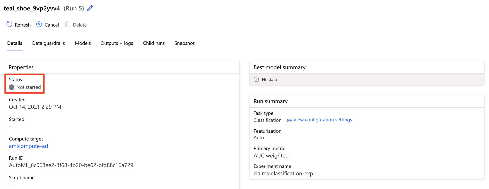

> Note: The Automated ML run will for around 40-60 minutes. It is recommended you complete Exercise 4 and then return to complete Exercise 3.

### Task 4: Review Best Model Performance

1. Select the **Models** tab to review the model pipelines that were trained during the experiment run.

  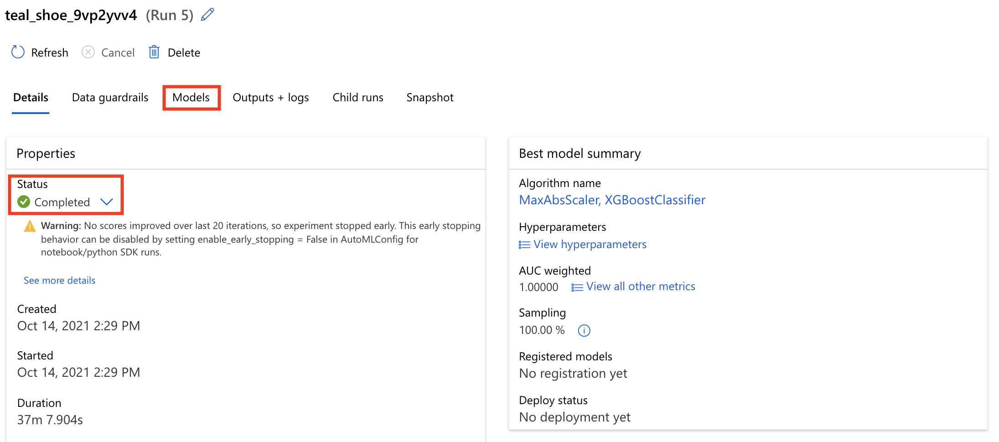

1. Select the **algorithm** with the best score on the primary metric `AUC weighted`.

  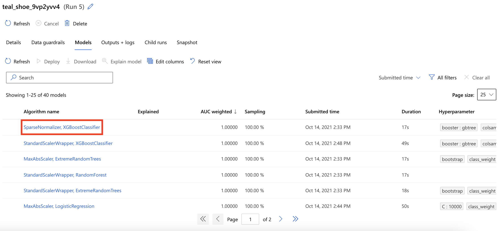

1. Select the **Metrics** tab to review the various performance metrics and charts.

  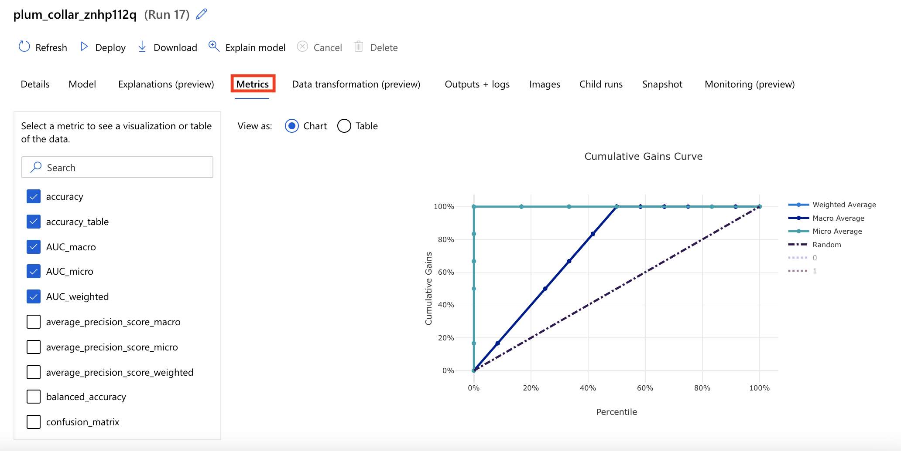

  > Note: You have the option to deploy the trained model pipeline to either Azure Container Instance or Azure Kubernetes Service directly from the Azure ML Studio.

## Exercise 4: Completing the solution

Duration: 45 minutes

In this exercise, you perform the final integration with the Text Analytics APIs and the Azure Machine Learning service you previously deployed to deliver the completed proof of concept solution.

### Task 1: Retrieve the Text Analytics API endpoint and key

In this task, you will retrieve the API key and endpoint URI associated with your Text Analytics API.

1. In the [Azure portal](https://portal.azure.com), select **Resource groups** from the Azure services list.

   

2. Select the `hands-on-lab-SUFFIX` resource group you created for this hands-on lab from the list of resource groups.

    

3. Select your Text Analytics Cognitive Services resource from the list.

    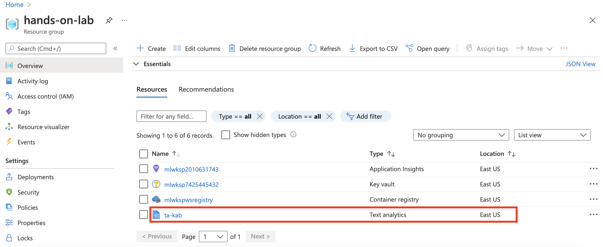

4. Select **Keys and Endpoint** from the left-hand navigation menu and then copy the **Key 1** and **Endpoint** values into a text editor, such as Notepad.exe, or something similar as you will need this value later in this exercise.

    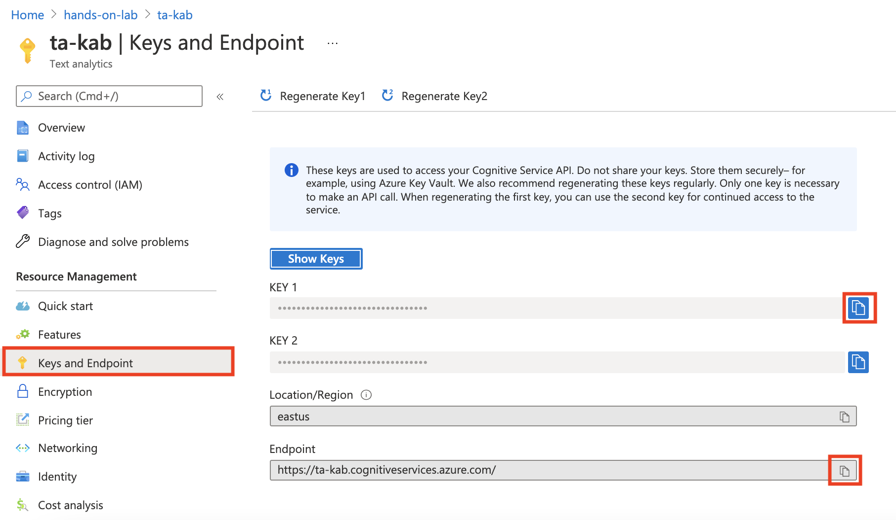

### Task 2: Run Notebook - 05 Cognitive Services

1. From within Azure Machine Learning Studio, navigate to the `Notebooks` section by selecting it from the left-hand navigation menu. Then select the notebook: **mcw-csdl/MCW-Analyzing-text-with-azure-machine-learning-and-cognitive-services/Hands-on lab/notebooks/05 Cognitive Services.ipynb**. This opens the notebook so you can read and execute the code it contains.

2. Follow the steps within the notebook to complete the lab and view the result of combining Cognitive Services with your Azure Machine Learning Services.

## After the hands-on lab

Duration: 5 minutes

To avoid unexpected charges, it is recommended that you clean up all your lab resources when you complete the lab.

### Task 1: Clean up lab resources

1. In the [Azure portal](https://portal.azure.com), select **Resource groups** from the Azure services list.

   

2. Select the `hands-on-lab-SUFFIX` resource group you created for this hands-on lab from the list of resource groups.

    

3. Select **Delete resource group** from the command bar.

    

4. In the confirmation dialog that appears, enter the name of the resource group, and select **Delete**.

5. Wait for confirmation the Resource Group has been successfully deleted. If you don't wait, and the delete fails for some reason, you may be left with resources running that were not expected. You can monitor using the Notifications dialog, which is accessible from the Alarm icon.

    

6. When the Notification indicates success, the cleanup is complete.

You should follow all steps provided _after_ attending the Hands-on lab.
